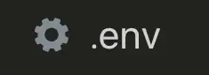
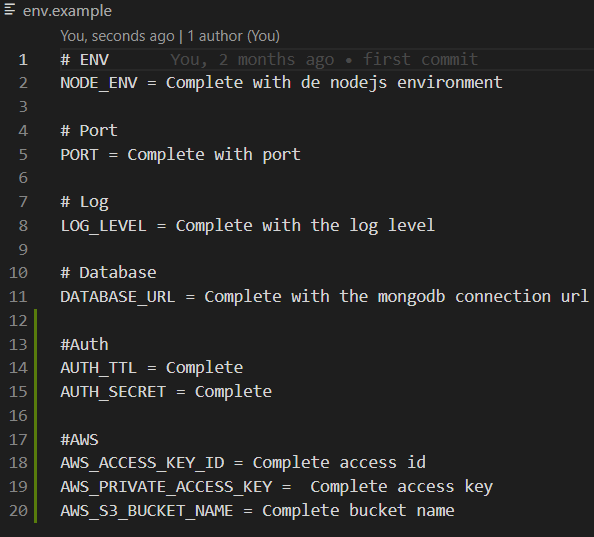
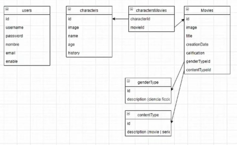
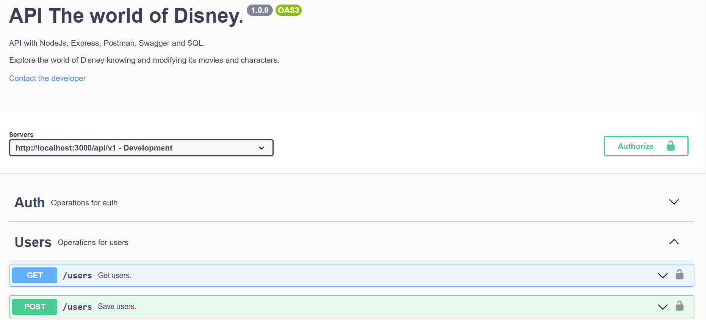

<h1 align="center">API The world of Disney.</h1>
<h4 align="center">Version 1.0.0
License ISC</h4>

> El presente repositorio contiene una API desarrollada para explorar el mundo de Disney, la cual permite conocer y modificar los personajes que los componen y entender en que peliculas estos participaron. 

## Online API 
-  [Heroku][heroku]

 [heroku]:https://git.heroku.com/node-10-challenge-alkemy.git

## The project uses the following dependencies (libraries)

- [NodeJs][nodejs]
- [Express][express]
- [Postman][postman]
- [Swagger][swagger]
- [SQL][sql]

[nodejs]: https://nodejs.org/es/
[express]: https://expressjs.com/es/
[postman]: https://www.postman.com/
[swagger]: https://swagger.io/
[sql]: https://www.mysql.com/

## Installing dependencies (libraries)

First, enter the root folder of the project:

> $ cd nueva-alkemy

Then install the dependencies:

> $ npm install

You have to place an ".env" file at the root of the project directory, with the properties for your environment.

In this file it is configured:

- Environment
- Application port
- Log level
- Database URL
- Auth
- AWS access

The properties can be copied from "env.example" :

- NODE_ENV
It's the environment of NodeJS. Possible values development | production

 - PORT
It's the port that the app will use to run. Change value to the desired port.

 - LOG_LEVEL
Log levels of the app. Each level has a specific priority. The higher the priority, the more important the message is considered. The levels are:

>    [
        error,
        warn,
        info,
        http,
        verbose,
        debug,
        silly
>    ]

 - DATABASE_URL
Connection URL to the MongoDB database. With the default configuration it will connect to a database in the MongoDB cloud that is already created and with data.

## Database Model

## Running the application
> $ npm run start

## Display of test results
The app has an endpoint to view the status of the last iteration of tests executed.

http://localhost:3000/tests-report

## Tests Result

Viewing the documentation
The app has an endpoint to view the documentation of the services. It is generated with Swagger.

http://localhost:3000/documentation/

Swagger Documentation

## Author

👤 **Florencia Garrido**

- Github: [@FlorenciaAGarrido](https://github.com/FlorenciaAGarrido)
- LinkedIn: [@florenciagarrido](https://www.linkedin.com/in/florenciagarrido/)

